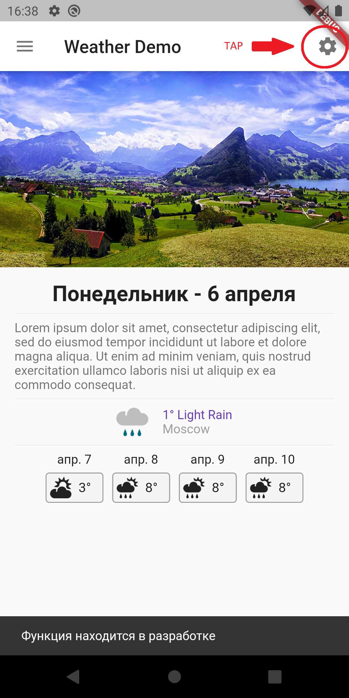

# Flutter Weather

Третий проект с использованием Flutter. Приложение выдает прогноз погоды по Москве с погодного сайта.  
Основная цель - познакомиться с более сложной компоновкой виджетов, использованием ассетов и некоторыми библиотеками.  
Посмотреть, как можно осуществлять переходы и передавать данные с экрана на экран.  
Использованные библиотеки:  
- cached_network_image (кеширование изображений)
- intl (локализация)
- http (запросы)

   
 
   
 
